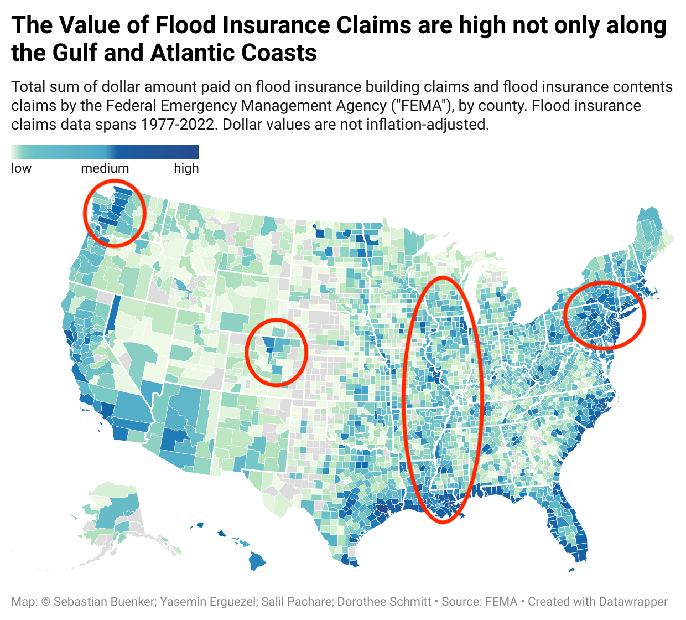
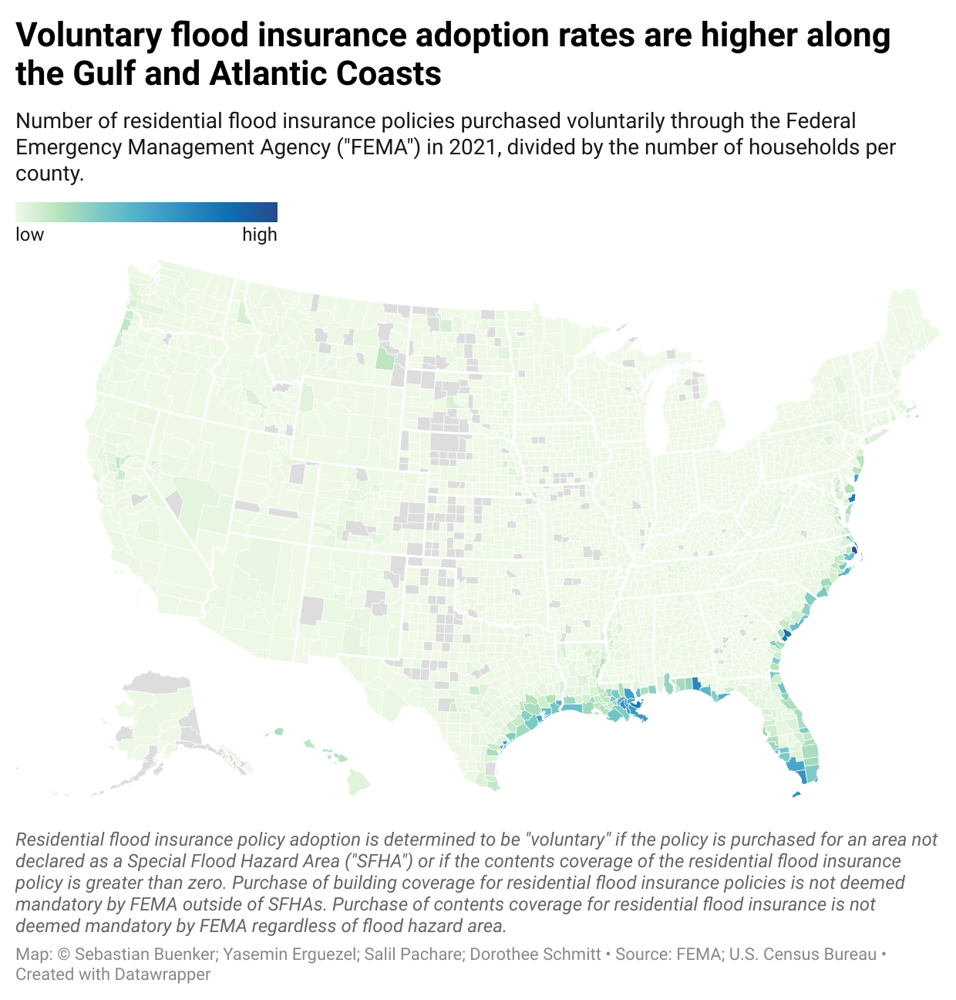
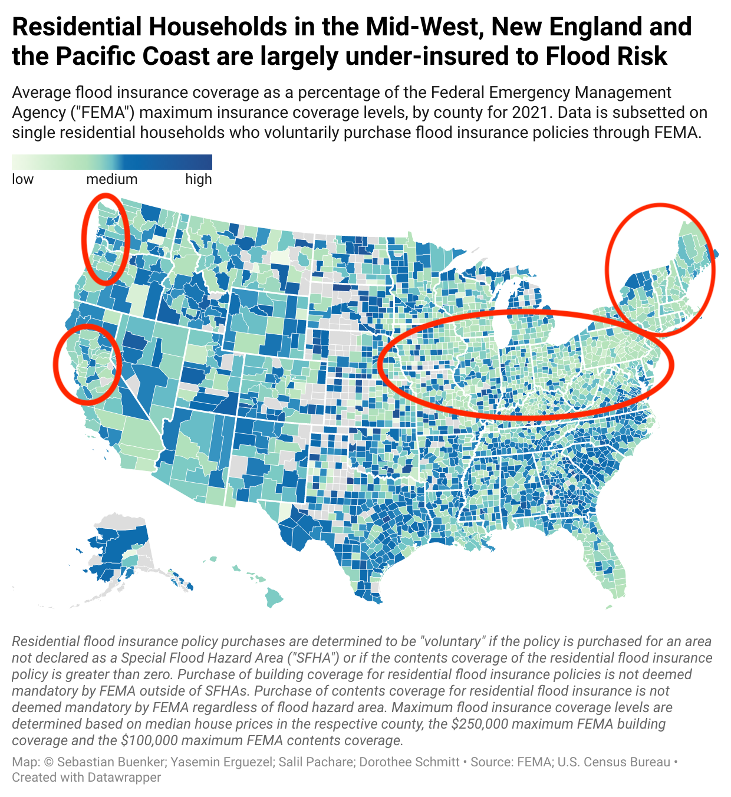
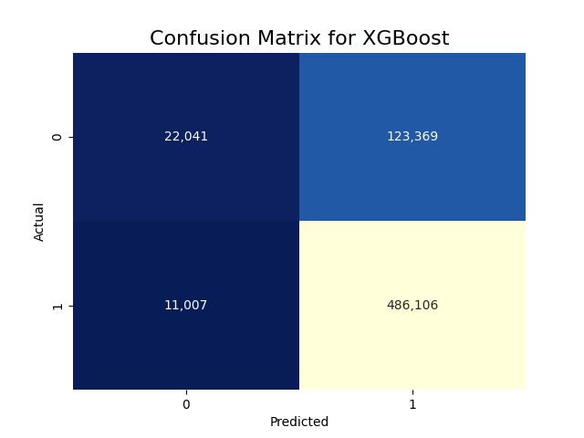

# Flood Insurance in the U.S. - Exploring New Market Opportunities

[Sebastian Buenker](https://github.com/sbuenker)

[Yasemin Erguezel](https://github.com/yaseminerguezel)

[Salil Pachare](https://github.com/saliloquy)

[Dorothee Schmitt](https://github.com/d-k-sch)


# Table of Contents
* [Overview](#Overview)
* [Regulatory Details](#regulatory-details)
* [Data Sources](#data-sources)
* [Exploratory Data Analysis](#eda)
* [Prediction of Insurance Claims Approvals](#ml-claims-prediction)
    * [Features Used and Feature Engineering](#features)
    * [Model Training and Testing](#model-train-test)
    * [Model Metrics](#metrics)
    * [Model Results](#results)
    * [Error Analysis](#errors)
    * [Business Value](#business-value)
* [Recommendations](#recommendations)
* [Future Work](#future)


# Overview <a id="Overview"></a>
Our changing climate has increased the frequency of extreme events, and this has been most noticeable in recent years. From an insurance perspective, to mitigate loss and damage associated with extreme weather events, households can purchase climate risk insurance policies. Furthermore, the increase in extreme weather events means that there is a greater need for insurers to factor in climate risk scenarios into their models for insurance claims payout. 

In this project, we aim to provide a fictitious stakeholder, namely a new entrant into the market for providing flood insurance policies, recommendations about the value this market provides. Namely, we seek to study and answer the following questions:

1. What does the current distribution of flood insurance policies and flood insurance claims look like?
2. Are there under-served, markets, that is, regions where the voluntary adoption of flood insurance policies is low, yet the risk of flooding is high? Identification of such regions could indicate profitable markets to enter and provide flood insurance policies.
3. For asset-liabilities risk management of our stakeholder, we create a machine learning model to predict flood claims that are likely to be approved.

For replication of this project, refer to the installation file [here.](installation.md) For the presentation delivered as part of the Neue Fische Data Science Bootcamp Graduation event, click [here.](./putlink)

# Regulatory Details <a id="regulatory-details"></a> (To Do)
* Keep this discussion brief.
* Discuss about FEMA.
* Explain caps on building and contents coverage.
* Discussion about the deregulation of the flood insurance market in 2019, and that this allowed private insurers to enter the market and provide insurance. Moreover, households could increase their coverage over the FEMA maximum.
* Discussion of voluntary and mandatory insurance, and that mandatory insurance is required in SFHA areas.  

# Data Sources  <a id="data-sources"></a>
The data on the National Flood Insurance Program ("NFIP") policies is obtained from the the [FEMA website](https://www.fema.gov/openfema-data-page/fima-nfip-redacted-policies-v1) from 2002-2022. There are approximately 61 million insurance policy transactions in the dataset. Key variables include insurance coverage amount on buildings/contents, policy start date, occupancy type, flood zone, and geographic characteristics such as zip codes, county codes and states. 

The data on NFIP claims is obtained from the [FEMA website](https://www.fema.gov/openfema-data-page/fima-nfip-redacted-claims-v1) from 1977-2022. There are approximately 2.5 million insurance claims in the dataset. Key variables include the amount paid on building/contents damage, date of damage, property age, occupancy type, elevation level, flood zone, and geographic characteristics such as zip codes, county codes and states.  

U.S. Census Data is obtained via the [CORGIS Dataset Project’s County Demographics Python Library](https://corgis-edu.github.io/corgis/python/county_demographics/). Key variables include the number of households and median house price value, obtained for each county. 

For more details on data cleaning, please refer to the following:
* For cleaning and collapsing policies data using Google BigQuery, click [here.](./bigquery)
* For cleaning claims data, click [here.](./putlink)
* For generating datasets at the state level, click [here.](./notebooks/state_data_generation.ipynb)
* Creation of utility helper functions, click [here.](./notebooks/utils/)

# Exploratory Data Analysis  (To Do) <a id="eda"></a>
Note that the maps below are interactive once you click on them. 

![number of claims over the years]

![value of claims over the years]

[](https://www.datawrapper.de/_/LICCb/)

[](https://www.datawrapper.de/_/khpdI/)

[](https://www.datawrapper.de/_/Wjsrd/)


There are five main findings from the figures above:

1.

2.

3. 

4. 

5.

For more detailed exploratory data analysis, please refer to the following:
* EDA Claims, located [here.](installation.md)
* States EDA, located [here.](./notebooks/states_eda.ipynb)
* Generation of csv files for maps, located [here.](./notebooks/maps_csvs.ipynb)
* Interactive Dashboard [here.](./putlink)

# Prediction of Insurance Claim Approvals <a id="ml-claims-prediction"></a>
For reliable capital planning for our stakeholder, we need to know as precisely as possible, how many claims we can expect to be accepted or rejected. Predicting this purely from the past ratio of approvals and rejections is a good start, but what if we can take into account the actual mix of new customers as to whether their claims are more likely to be approved or rejected? We therefore develop a classifier model for claim approval or rejection. 

In our machine learning model, we classify **1** as the insurance claim was accepted, and **0** if the insurance claim was rejected. An insurance claim is accepted if the amount paid on building/contents damage is greater than 0.

## Features Used and Feature Engineering <a id="features"></a>
* We use various categorical, time, geographic, and numerical variables as features in our model. For more details on the variables used, click [here.](./notebooks/pipeline_xgboost_new.ipynb) 
* All categorical features are one-hot encoded.
* All numerical features are standardized.


## Model Training and Testing <a id="model-train-test"></a>
* The purpose of our model is to predict claim approvals in the cross-section, and not to predict the time-series fluctuations in claim approvals. As such, our train-test split has no time-series component. 
* We use 75% (1,927,566 observations) in our training set, and 25% (642,523 observations) in our test set.
* We stratify our sample to ensure that the same ratio of claim approvals and rejections is the same in both the train and test sets. 

## Model Metrics <a id="metrics"></a>
* Minimizing false positives and false negatives would be important for our stakeholder.
* False Positives
    * Claims that are predicted to be approved but are actually rejected. 
    * If our stakeholder determines their capital requirements based on their predictions, in this case, they would hold too much money on their balance sheet. 
    * This represents an "opportunity cost", that is, the money could have been invested in assets yielding higher return.   
* False Negatives
    * Claims that are predicted to be rejected but are actually approved.
    * If our stakeholder determines their capital requirements based on their predictions, in this case, they would py out more claims than predicted.
    * The stakeholder could therefore borrow this shortfall amount to payout these claims.
* Since false positives and false negatives are both important, we focus on **weighted average F1-Score** as a measure of model evaluation and performance.

## Model Results <a id="results"></a>
For insurance claims classification, we run two models: 
  
* **Proportions Model**: This is the baseline model. In the data, 76% of the actual claims are approved. We apply this percentage and assume that 76% of the actual approved claims are predicted to be approved; 24% of the actual rejected and predicted to be rejected.

* **XGBoost Model** with hyperparameter tuning.

Our approach for hyperparamter tuning for the XGBoost model is to: (1) Choose a random sample of 10% of the training data after the train-test split; (2) Run a randomized grid search with 5-fold cross validation; (3) Apply the chosen hyperparameters to the full test data. For the actual hyperparameters used in the XGBoost model, please refer [here.](./notebooks/pipeline_xgboost.ipynb)

The table below shows results on the test set for the two models.

|Model|Weighted-Average F1-Score (Test)|
|--|--:|
|Proportions Model (Baseline)|-0.635|
|XGBoost Model|0.736|


## Error Analysis <a id="errors"></a>




* Relative to the baseline model, the XGBoost model has a slight increase in false positives, but drastically reduces the number of false negatives. This indicates that our model has slightly worse performance at correctly predicting claim approvals.

## Business Value <a id="business-value"></a>
To calculate the monetary loss under the baseline model and under the XGBoost model, we make the following assumptions:
* Average claim size for false positive classifications is the same as false negative classifications.
* The stakeholder allocates their capital requirements based on the prediction number of claim approvals and non-approvals at the start of each year.
* Assume that our stakeholder can borrow at the risk-free rate (assume **2% p.a.**) when capital on their balance sheet is not enough to meet claim payouts. 
* Assume that our stakeholder forgoes the S&P500 average market return (assume **7% p.a.**) when they hold too much capital on their balance sheet.

The table below compares the dollar value of claims misclassification per year, for the baseline model and the XGBoost model.

||Proportions Model (Baseline)|XGBoost Model|
|--|--:|--:|
|False Positives|$67.7 million|$71.3 million|
|False Negatives|$64.5 million|$60.6 million|
|Total|$132.3 million|$77.3 million|

The XGBoost model therefore reduces loss to our stakeholder of **$54.9 million per year!**

The average dollar value per year is calculated as follows:
```
Average $ Value of False Positives/Year = Total Number of False Positives x Average Claim Size x (1/Number of Years) x (1 + 0.07)

Average $ Value of False Negatives/Year = Total Number of False Negatives x Average Claim Size x (1/Number of Years) x (1 + 0.02)

Number of Years = 45 (difference between 2022 and 1977)
Average Claim Size = $24299.00 (estimated from the claims data)
```

# Recommendations <a id="recommendations"></a>
* Counties along the Mississippi, the Pacific Northwest, around Denver, and New England show a high amount of property damage from floods. These could be underserved markets, because flood insurance adoption rates are low, yet payouts high. Our stakeholder can increase revenue by selling flood insurance policies in these areas.
* Households in the Mid-West, New England and the Pacific coasts that voluntarily purchase flood insurance are largely under–insured relative to FEMA maximum insurance coverage. Our stakeholder could offer more insurance protection for these households, thereby generating more revenue for insurance premiums. 
* XGBoost model for prediction of insurance claims can reduce losses for our stakeholder by approximately $54.9 million per year.

# Future Work <a id="future"></a>
* We would like to examine whether the number of flood insurance policies bought can be explained using historic insurance claims. 
    * The motivation of this comes from our data analysis which shows that after regional flood events, there is a contemporaneous increase in insurance claims and a future increase in voluntary flood insurance policies bought in the region.
    * There is no significant increase in claims and voluntary flood insurance policies bought in other regions not affected by the flood event.
    * For analysis after the Louisiana Floods in 2016, refer to [link to Doro's notebook on state analysis].

* We would like to estimate the elasticity of flood insurance adoption with respect to insurance premiums. 
    * The purpose of this analysis is to see how responsive the purchase of voluntary flood insurance is to changes in insurance premiums.
    * This analysis can yield new public policy insights, for example, are there certain regions that the government should subsidize if flood insurance adoption rates are very elastic? 
    * To estimate the elasticity, we would use techniques from CausalML.

